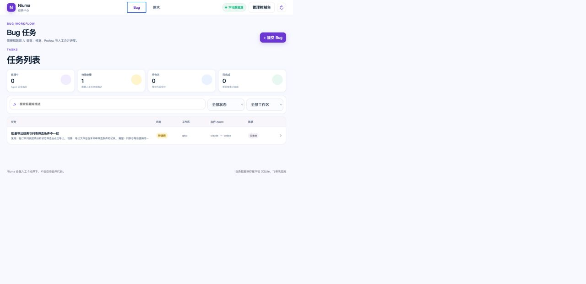
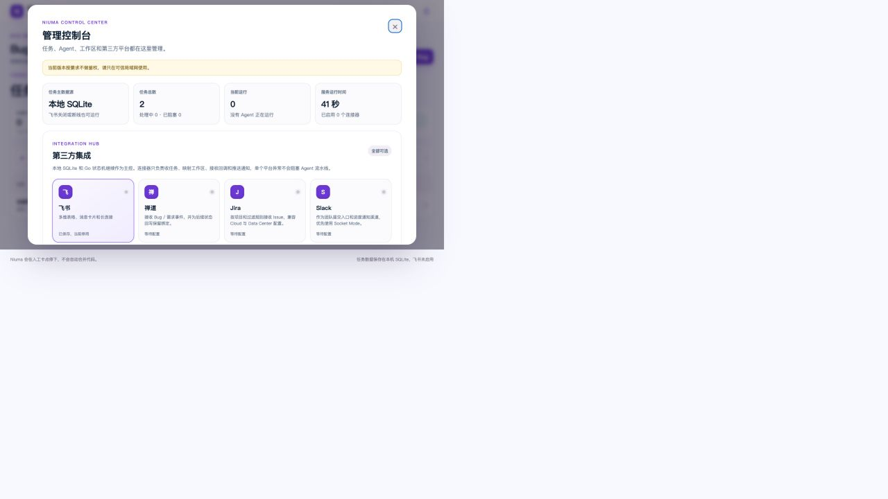

# Niuma — local-first AI development orchestration

Niuma turns Bugs and requirements into controlled AI development workflows. Its
Go daemon stores tasks in local SQLite, drives Claude/Codex/Cursor/Gemini CLIs,
and keeps investigation, code changes, tests, review and delivery behind explicit
human gates.

The browser task center is the default entry point. Feishu, ZenTao, Jira and
Slack are optional connectors; disabling one of them does not stop local tasks or
the agent pipeline.



## What it does

- **Local task center** — create, edit, filter and archive Bug and requirement
  tasks, upload supporting files and inspect live agent output.
- **Requirement workflow** — intake → AI clarification → human PRD confirmation
  → development → independent review → human delivery.
- **Bug workflow** — investigation → affected-file registration → minimal fix →
  test gate → independent review → bounded repair loop → human merge.
- **Conflict-aware Bug coordination** — similar Bugs are surfaced; when active
  tasks claim overlapping files, later writers wait and continue from the
  reviewed predecessor instead of modifying the same area concurrently.
- **Three workspace strategies** — edit the current checkout (`inline`), create
  one isolated worktree per task, or use a shared development session.
- **Shared development sessions** — create a clean, untracked session branch from
  the configured baseline; run task worktrees in parallel; integrate reviewed
  commits serially; freeze the session and let a human choose the final target.
- **Operational safeguards** — execution leases, heartbeats, crash recovery,
  retry ceilings, inactivity watchdogs, immutable agent artifacts and explicit
  blocked states.
- **Optional integrations** — Feishu sync and cards, plus ZenTao/Jira/Slack
  connection management and validated event ingestion.



## Architecture

```text
Browser / optional connectors
            │
            ▼
     Go control plane
     ├─ local SQLite task source of truth
     ├─ validated state machine and execution leases
     ├─ workspace / worktree / development-session coordinator
     ├─ CLI adapters for Claude, Codex, Cursor and Gemini
     └─ embedded task center and management console
            │
            └─ Bug tasks → Python LangGraph sidecar
                           investigate → fix → test → review
```

The Go process owns task state, Git policy, locks, connector state and agent
processes. The Python package in [`buggraph/`](buggraph/) owns only the durable
Bug repair graph and its checkpoint routing.

## Execution strategies

| Strategy | Use case | Concurrency and delivery |
| --- | --- | --- |
| `inline` | One trusted local checkout, human commits | Serialized per workspace; no automatic branch or commit |
| task worktree | Independent delivery per task | Tasks can run in parallel; each task keeps its own branch |
| shared session | Many tasks should converge into one delivery branch | Task worktrees run in parallel; reviewed commits enter the session branch serially |

Shared sessions never merge into `main`, `test` or another product branch on
their own. With `delivery_target: "user_choose"`, Niuma deliberately stops after
freezing the session and leaves the destination to the user.

## Quick start

Prerequisites:

- Go 1.25.5 or newer;
- Git and at least one logged-in agent CLI;
- Python 3.10+ only when using the Bug LangGraph workflow.

```bash
git clone <your-repo-url> agent-pipeline
cd agent-pipeline
cp .env.example .env
# Set PIPELINE_REPO_PATH in .env, or create workspaces.json from the example.

cd go
GOPROXY=https://goproxy.cn,direct go build -o niuma .
./niuma
```

Open `http://localhost:8787`. This local-only setup does not require Feishu.

To enable the Bug workflow:

```bash
cd ../buggraph
python3 -m venv .venv
.venv/bin/python -m pip install -e .
```

Detailed setup and operations:

- [Quick start](docs/quickstart.md)
- [Go daemon and workflow guide](go/README.md)
- [Configuration reference](docs/config-reference.md)
- [Operations and recovery](docs/operations.md)
- [Agent CLI setup](docs/agent-cli-setup.md)
- [Optional third-party integrations](docs/third-party-integrations.md)
- [Feishu setup](docs/feishu-app-setup.md)
- [Windows setup](docs/windows-install.md)

## Safety boundaries

- The web console currently has no authentication and uses plain HTTP. Bind it
  only to a trusted machine or LAN; do not expose port `8787` directly to the
  public internet.
- Connector secrets and runtime databases live under the ignored `state/`
  directory. APIs return masked secret metadata rather than saved values.
- Niuma-created task and session branches do not track the baseline branch.
- A successful agent call is not acceptance evidence: configure a real
  workspace `test_cmd` for code that must pass an executable gate.
- Final delivery and branch merging remain human decisions.

## Development verification

```bash
cd go
go test ./...
go build ./...

cd ../buggraph
.venv/bin/python -m unittest discover -s tests -v
```

## License

See [LICENSE](LICENSE).

---

# 牛马自救中心 · 中文说明

Niuma 是一个本地优先的 AI 开发调度器：任务保存在本机 SQLite，局域网页面是默认入口，飞书、禅道、Jira 和 Slack 都是可选连接器。它不会替人决定最终合并，而是把 AI 的调查、修改、测试和 Review 放进可观察、可暂停、可追溯的流程中。

当前重点能力包括：Bug 与需求双流程、附件与实时进度、Claude/Codex/Cursor/Gemini CLI 调度、Bug 文件热点协调、独立 worktree、共享开发会话、人工验收与最终交付门。

最小启动只需要配置目标仓库并运行 Go 进程；需要修 Bug 时再安装 `buggraph` 的 Python 依赖。完整中文步骤见 [快速开始](docs/quickstart.md) 和 [配置说明](docs/config-reference.md)。
