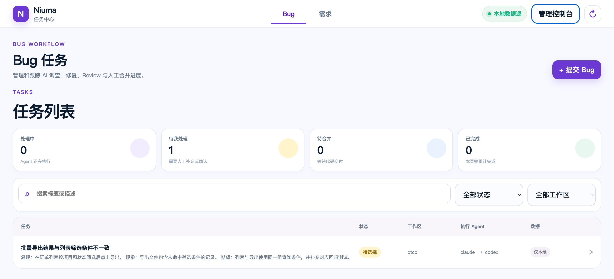
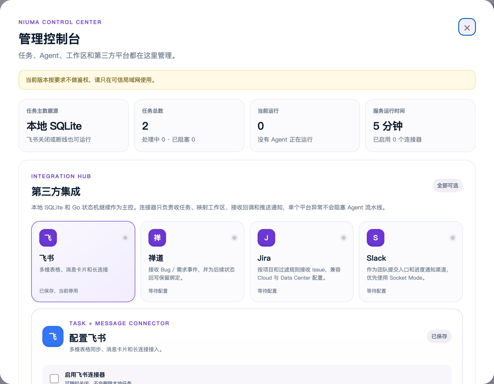

# niuma（Go 实现）

把任务丢进局域网页面或可选的飞书连接器，Agent 替你澄清 → 开发 → Review → 交付。
listener + dispatcher 合并为一个 Go 常驻进程，goroutine 并发；仅 Bug 返修环会启动本地 Python LangGraph 子进程。

任务主数据保存在本机 `state/niuma.sqlite3`。飞书不再是启动必需项：未配置或关闭飞书时，页面、调度器和 Agent 仍可独立运行；启用后负责导入飞书记录、回写状态和发送通知。

## 局域网任务中心

服务默认同时监听 `:8787`，局域网用户访问 `http://<这台机器的局域网 IP>:8787` 后，可以在 `Bug / 需求` 两个页签中分别录入和管理任务：

- 新建 Bug，选择代码工作区和 Claude/Codex/Cursor 修复 Agent；
- 上传图片、PDF、Excel 或 CSV 附件；图片可预览、文档可打开或下载，Agent 会在 Bug 档案中读取附件；
- 在「待选择 / 待回答 / 已阻塞」阶段修改描述和补充信息；
- 确认后启动既有的 worktree → 修复 → 测试 → 独立 Review → 人工合并路线；
- 查看本机任务库中的状态和执行日志，启用飞书后自动同步；
- 在 Bug 卡片内展开 AI 执行过程，实时查看各阶段状态及 Agent 调查、修复、验证和 Review 结果。
- 在需求页签完成录入、AI 澄清、人工确认、开始开发、独立 Review 和人工合并，并查看 PRD 与阶段进度。
- 打开 `/manage` 管理任务停止/重试/完成/归档、飞书/禅道/Jira/Slack 连接、默认 Agent 和工作区。





页面和 API 按当前部署要求不设登录。连接器密钥只保存在服务端，管理 API 不回传明文；飞书设置位于 `state/integration.json`，其他连接器位于权限为 `0600` 的 `state/integrations.json`，均不进入 Git。此入口使用普通 HTTP，只适合可信局域网，不应直接暴露公网。`NIUMA_WEB_ENABLED=0` 可完全关闭。

第三方集成中心当前支持连接配置、远端 API Token 测试、工作区映射，以及禅道/Jira Webhook 的验 Token、幂等去重和本地事件入队。事件到任务的完整字段拉取、双向状态回写和 Slack Socket Mode 消费仍是后续阶段，详见 [../docs/third-party-integrations.md](../docs/third-party-integrations.md)。

---

## 前置条件

- **Go 1.25+**（仅构建时需要）
- **Python 3.10+**（仅 Bug LangGraph 流水线需要；普通需求仍只走 Go）
- **Git**，以及一个目标代码仓库
- 至少一个**可无头运行的 Agent CLI**，并已登录可用：
  - 需求默认使用 Cursor 澄清/开发、Gemini Review
  - Bug 默认使用 Claude 修复、Codex Review
  - 也支持按任务或管理设置切换到其他受支持 Agent
- 可选：一个**飞书自建应用**（开通多维表格读写 + IM 发消息 + 长连接接收私聊），详见 [../docs/feishu-app-setup.md](../docs/feishu-app-setup.md)

---

## 从零运行

### 1) 克隆 & 构建

```bash
git clone <your-repo-url> agent-pipeline
cd agent-pipeline/go
GOPROXY=https://goproxy.cn,direct go build -o niuma .
```

Bug 调查/修复流程需要额外安装 Python sidecar；只使用需求流程时可以跳过：

```bash
cd ../buggraph
python3 -m venv .venv
.venv/bin/python -m pip install -e .
cd ../go
```

> 交叉编译分发 Go 控制面（普通需求链路仍是单文件；Bug 链路还需部署 `buggraph/` 与 Python 环境）：
> ```bash
> GOOS=linux  GOARCH=amd64 go build -o niuma-linux .
> GOOS=darwin GOARCH=arm64 go build -o niuma-mac   .
> ```

### 2) 配置 `.env`

`.env` 放在**仓库根**（即 `go/` 的上一层），程序会自动在 `./.env` / `../.env` 里找：

```bash
cp ../.env.example ../.env
# 编辑 ../.env，至少设置 PIPELINE_REPO_PATH；
# 或创建 workspaces.json，配置一个以上有效工作区。
# 飞书四项配置均为可选，本地页面和 Agent 流程不依赖飞书启动。
```

常用可选项：

| 环境变量 | 默认 | 说明 |
|---|---|---|
| `PIPELINE_ENGINE_CLARIFY` / `_CODE` / `_REVIEW` | `cursor` | 各阶段默认 Agent |
| `PIPELINE_MAX_CONCURRENCY` | `2` | 并发上限（澄清并行、不同工作区并行各占一个名额） |
| `PIPELINE_SETUP_GATE` | `1` | 开=新需求先进「需求池」等人勾选；关=直接开跑 |
| `PIPELINE_BATCH_DEVELOP` | `1` | inline 下多需求合批成一次开发调用 |
| `PIPELINE_INLINE_SKIP_GATE` | `1` | inline 开发跳过自动测试门（由人决定 Review） |
| `PIPELINE_TEST_CMD` | 空 | 验收门 shell，exit 0 视为通过；空则不跑 |
| `PIPELINE_POLL_INTERVAL` | `900` | 兜底轮询秒数（主要靠事件驱动） |
| `PIPELINE_AGENT_RUNS_KEEP` | `200` | `state/agent-runs/` 保留最近 N 次调用产物 |
| `PIPELINE_ENGINE_BUG_FIX` / `_BUG_REVIEW` | `claude` / `codex` | Bug 修复与独立 Review Agent（可选 Claude/Codex/Cursor，必须不同） |
| `PIPELINE_BUG_REPAIR_LIMIT` | `2` | 测试失败或 Review FAIL 后最多返修总轮数 |
| `PIPELINE_BUG_GRAPH_PYTHON` | 自动发现 `buggraph/.venv` | LangGraph Python 解释器 |

多工作区 / worktree 模式 / SCM 见 [../workspaces.example.json](../workspaces.example.json) 与 [../docs/config-reference.md](../docs/config-reference.md)。

### 3) 可选：准备飞书多维表格（Base）

新建一张多维表格，加好这些字段，并把表格 URL 里的 `app_token` / `table_id` 填进 `.env`
的 `PIPELINE_BASE_TOKEN` / `PIPELINE_TABLE_ID`。字段名必须**完全一致**：

- 文本/单选：`需求标题` `需求描述` `澄清记录` `PRD` `分支PR链接` `执行日志` `失败次数` `提需求人` `会话ID` `工作区`
- Agent 单选：`执行Agent` `澄清Agent` `开发Agent` `ReviewAgent`
- 任务类型单选：`任务类型`，选项为 `需求` / `Bug`
- **`状态`（单选）必须包含这些选项**（名字完全一致，少一个会导致写入被飞书拒绝）：

  ```
  待选择 · 待澄清 · 待回答 · 待确认 · 待开发 · 开发中 · Bug处理中 · 等待代码区域 · Review中 · 待合并 · 完成 · 已阻塞
  ```

已有表可先检查再幂等补齐：

```bash
./niuma schema-check-bug
./niuma schema-ensure-bug
```

详见 [../docs/feishu-app-setup.md](../docs/feishu-app-setup.md)。

### 4) 运行

前台跑（先这样验证）：

```bash
./niuma
```

纯本地模式看到「数据源=本地」「Web 控制台启动」和「扫描 N 条记录」即正常。启用飞书后还会建立长连接并执行首次同步。

---

## 装成常驻服务

### macOS（launchd）

把下面存成 `~/Library/LaunchAgents/com.niuma.rescue.plist`，**改掉两处路径**为你的实际路径：

```xml
<?xml version="1.0" encoding="UTF-8"?>
<!DOCTYPE plist PUBLIC "-//Apple//DTD PLIST 1.0//EN" "http://www.apple.com/DTDs/PropertyList-1.0.dtd">
<plist version="1.0">
<dict>
  <key>Label</key>            <string>com.niuma.rescue</string>
  <key>ProgramArguments</key> <array><string>/ABS/PATH/agent-pipeline/go/niuma</string></array>
  <key>WorkingDirectory</key> <string>/ABS/PATH/agent-pipeline/go</string>
  <key>EnvironmentVariables</key>
  <dict><key>PATH</key><string>/Users/你/.local/bin:/opt/homebrew/bin:/usr/local/bin:/usr/bin:/bin</string></dict>
  <key>RunAtLoad</key> <true/>
  <key>KeepAlive</key> <true/>
  <key>StandardOutPath</key>   <string>/ABS/PATH/agent-pipeline/logs/niuma.log</string>
  <key>StandardErrorPath</key> <string>/ABS/PATH/agent-pipeline/logs/niuma.log</string>
</dict>
</plist>
```

> `PATH` 必须包含你的 Agent CLI 所在目录（如 `cursor-agent` 在 `~/.local/bin`），否则常驻进程找不到命令。

```bash
launchctl bootstrap gui/$(id -u) ~/Library/LaunchAgents/com.niuma.rescue.plist
launchctl kickstart -k gui/$(id -u)/com.niuma.rescue   # 重新构建后用它重启
tail -f logs/niuma.log
```

### Linux（systemd，用户级）

`~/.config/systemd/user/niuma.service`：

```ini
[Unit]
Description=niuma feishu pipeline
[Service]
WorkingDirectory=/ABS/PATH/agent-pipeline/go
ExecStart=/ABS/PATH/agent-pipeline/go/niuma
Environment=PATH=/home/你/.local/bin:/usr/local/bin:/usr/bin:/bin
Restart=always
[Install]
WantedBy=default.target
```

```bash
systemctl --user enable --now niuma
journalctl --user -u niuma -f
```

### Windows

`niuma.exe` 是控制台程序，直接跑会**一直挂一个 cmd 窗口**。推荐装成 Windows 服务（[NSSM](https://nssm.cc/)），
后台无窗口、开机自启、崩溃自愈：

```cmd
nssm install niuma "C:\path\agent-pipeline\go\niuma.exe"
nssm set niuma AppDirectory "C:\path\agent-pipeline\go"
nssm set niuma AppStdout "C:\path\agent-pipeline\logs\niuma.log"
nssm set niuma AppStderr "C:\path\agent-pipeline\logs\niuma.log"
nssm set niuma AppEnvironmentExtra "PATH=C:\path\to\agent-cli;%PATH%"
nssm start niuma          :: 重新 build 后用 nssm restart niuma
```

不想装服务也可以编译成无窗口程序：`go build -ldflags="-H=windowsgui" -o niuma.exe .`。
完整三种方式（NSSM / 无窗口编译 / 任务计划程序）见 [../docs/windows-install.md](../docs/windows-install.md)。

---

## 工作流程（默认 inline 模式）

```
飞书发「需求：<一句话>」
   └─ 进「需求池(待选择)」，回一张多选卡片
        └─ 勾选要做的几条 → 「✅ 确认开始」
             └─ 待澄清（多条并行澄清）→ 待回答(补充) / 待确认(确认 PRD)
                  └─ 确认 → 进「待开发」队列（攒着，不自动跑）
                       └─ 点「🚀 开始开发本批」→ 开发中（同工作区合批成一次执行）
                            └─ 待合并 → 「🔍 做 Review」或「确认已人工合并并完成」
```

Bug 走独立最小链路：

```text
飞书发「Bug@claude：<现象>」（也可用 @codex / @cursor）
   └─ 待选择 → 强制创建 BUG worktree
        └─ 修复 Agent 调查 → 登记预计修改文件
             ├─ 与运行中任务重叠 → 等待代码区域
             └─ 无重叠 → 修复 → test_cmd
             └─ 另一个 Agent 只读 Review
                  ├─ FAIL → 返回修复（最多 2 轮）
                  ├─ NEEDS_INPUT → 待回答
                  └─ PASS → 本地提交/按配置推送 → 待人工合并
测试失败 ──→ 返回修复；达到返修上限后阻塞，不进入 Review
Bug 完成 ──→ 校验目标分支已包含 Bug 提交或等价补丁
```

Bug 流水线默认不 push、不建 PR，且永不自动合并，也不会使用 inline 工作树；只有工作区显式开启 push/PR 时才执行对应发布动作。普通 `task` 策略下每个 Bug 使用独立交付分支；`session` 策略下每个 Bug 仍在独立临时 worktree 中执行，但 Review 通过后会串行进入共享会话分支。

相似 Bug 会在页面提示；调查命中相同文件时，后来的任务保留调查结果并暂停写代码。前置任务 Review 通过后，后续任务分支会自动接到前置分支上继续，页面展示人工合并顺序。

- **inline**（默认）：所有需求在 `PIPELINE_REPO_PATH` 的**当前工作树**上改动，不自动提交，由人决定。
- 想每条需求隔离独立目录/分支、自动 push/PR/MR：在 `workspaces.json` 用 `work_mode: "worktree"`，并可用 `worktree_base` 指定这些目录的统一位置；新分支从最新远端基线创建且不跟踪主线。若规则未提交到主线，可用 `rules_source` 把来源仓库的 `AGENTS.md` 和 `.claude/rules` 链接到每个目录。
- 想每天从最新主线创建一个统一交付分支，同时避免慢 Agent 阻塞：增加 `workspace_scope: "session"`、`queue_mode: "parallel"`、`session_rollover: "daily"`。任务 worktree 并行执行，只有 Review 后进入会话分支的 Git 动作串行。
- 同一 inline 工作区内开发/Review 串行（共享一棵树）；澄清并行；不同工作区整体并行。

---

## 飞书命令

| 命令 | 作用 |
|---|---|
| `需求：<描述>` | 提一个新需求进需求池 |
| `Bug@claude：<现象>` / `Bug@codex：<现象>` / `Bug@cursor：<现象>` | 提交 Bug；指定修复 Agent，系统自动选择不同的 Review Agent |
| `需求池` / `池子` | 列出待选择需求（可勾选确认） |
| `开始开发` | 把「待开发」队列整批开跑 |
| `看板` / `状态` / `配置` / `诊断` | 查看在途需求 / 当前需求 / 选 Agent 工作区 / 单条诊断 |
| `健康` / `统计` / `周报` | 服务健康 / 运行报表 |
| `重试` / `清锁` / `重新澄清` / `解除阻塞` / `完成` | 恢复类操作 |
| `切换Agent <claude\|codex\|gemini\|cursor>` / `切换工作区 <key>` | 改当前需求的 Agent / 工作区 |

---

## 注意

- **一个飞书 app 只能有一个长连接消费者。** 别同时跑第二个 listener（比如老的 Python 版或
  Hermes gateway 用同一个 app），否则两边抢事件、行为会错乱。
- 状态/锁/去重存在 `<仓库根>/state/niuma.sqlite3`；每次 Agent 调用的 prompt/输出/元数据
  落在 `state/agent-runs/`（保留最近 `PIPELINE_AGENT_RUNS_KEEP` 次）。
- 重新构建后用 `launchctl kickstart -k …`（或 `systemctl --user restart niuma`）重启才会生效。
